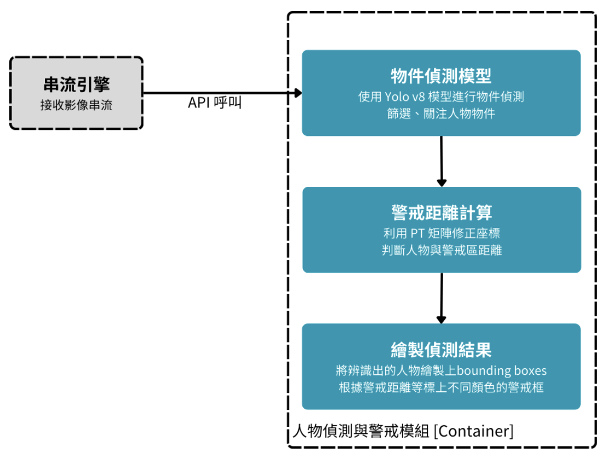
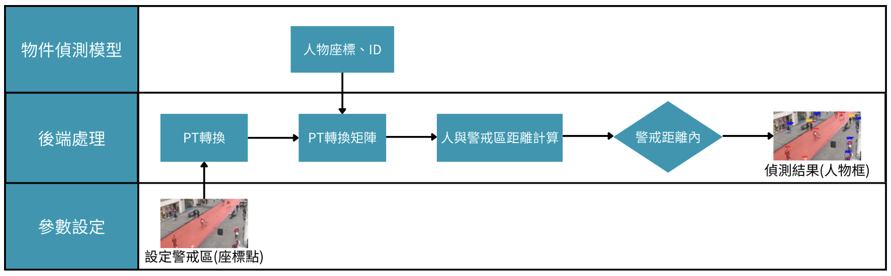

# AI 街道安全助手

[](https://hub.docker.com/r/chunyu612016/ai_cctv)

AI 街道安全助手是針對行人交通安全的解決方案。在道路中透過攝影鏡頭偵測街道上的行人動態，並且適時提出警告，以保護行人安全。

專案使用 Yolo v8 作為偵測基礎模型。主要具有以下三個功能
1. **人體檢測與標註**：檢測圖像中的人體並繪製邊界框
2. **電子圍欄警示**：判斷檢測到的人體是否位於指定的警戒區域內
3. **距離測量與提醒**：計算偵測到的人體與警戒區的距離。當人體距離警戒區過近時，發出提醒


## 系統架構
### 整體架構


### 距離偵測 API 流程


## 使用說明

### 環境安裝
**使用 docker 映像檔**
1. 從 Docker Hub 拉取映像檔：
    ```bash
    docker pull chunyu612016/ai_cctv
    ```
2. 運行 Docker 容器：會自動啟動 FastAPI。預設情況下，應用將運行在 `8888` 端口，可以透過 http://localhost:8888/docs# 進入 FastAPI 介面：
    ```bash
    docker run -p 8888:8888 chunyu612016/ai_cctv
    ```
    如果希望修改運行端口，可以在運行容器時使用 `-e APP_PORT=<your_port>` 參數來設定 `APP_PORT` 環境變量的值，並將 `-p` 參數的值也做相應的修改。例如：
   `docker run -p 9999:9999 -e APP_PORT=9999 chunyu612016/ai_cctv`


### 使用說明

本系統提供以下 API 端點，接受圖像輸入：
- `/detect/` - 人體識別並標註結果
- `/inside_outside_alert/` - 判斷人體是否在警戒區內
- `/distance_to_alert_zone/` - 計算人體距離警戒區的距離

測試方法：\
透過 http://localhost:8888/docs# 進入 FastAPI 介面，上傳 example 的一張圖片，即可獲得繪製檢測結果圖